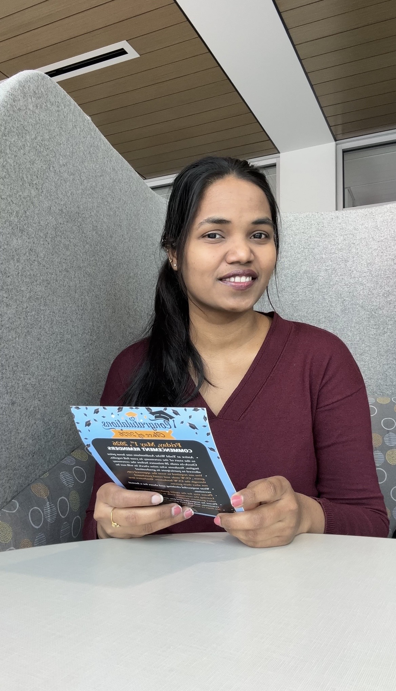

<h1 align="center">Hi 👋, I'm Srujana Challuri</h1>
<h3 align="center">Full-Stack Developer | AI/ML Enthusiast | Software Developer</h3>

<p align="center">
  
</p>

<p align="center">
  
  
</p>

<div align="center">
  
</div>

 <br/>
 <div align="center">

</div>
---

### 🙋‍♀️ About Me

- 🎓 **Master's in Computer Science** @ Concordia University, Milwaukee (GPA: **4.0**)  
- 💼 **3+ years** of professional experience at **Accenture** building cloud-native microservices & APIs  
- 🤖 Independently built **3 full-stack AI applications** using Python, Java, React, FastAPI, Groq AI & Firebase  
- 🚀 Delivered **$3M+ in cost savings** through platform migrations and automation at enterprise scale  
- 🐍 Built Python automation scripts processing **1,000+ podcast episodes**, saving 15+ hours/week  
- 📫 Reach me at **srujanachalluri@gmail.com**  
- 📍 Based in **Milwaukee, WI**

---

### 🔗 Connect with Me

<p align="left">
  <a href="https://linkedin.com/in/srujanachalluri" target="_blank">
    
  </a>
  <a href="https://github.com/srujanachalluri" target="_blank">
    
  </a>
  <a href="mailto:srujanachalluri@gmail.com">
    
  </a>
</p>

---

### 🛠️ Tech Stack

#### 👩‍💻 Languages
<p>
  
  
  
  
  
  
  
</p>

#### 🎨 Frontend
<p>
  
  
  
  
  
</p>

#### ⚙️ Backend & APIs
<p>
  
  
  
  
  
</p>

#### 🤖 AI / ML
<p>
  
  
  
  
  
</p>

#### ☁️ Cloud & DevOps
<p>
  
  
  
  
  
  
  
</p>

#### 🗄️ Databases
<p>
  
  
  
</p>

---

### 🚀 Featured Projects

#### 🧠 [AI Resume Builder](https://ai-resume-builder-iota-five.vercel.app/) &nbsp; | &nbsp; `React` `Groq AI (Llama 3.3 70B)` `Firebase` `Vite` `Vercel`
> Paste a job description + your resume → AI rewrites it with **ATS scoring & keyword gap analysis**. Features PDF export, Google OAuth, Firebase history, and a free API key fallback system.

---

#### 🎤 [AI Interview Coach](https://ai-interview-coach-roan.vercel.app/) &nbsp; | &nbsp; `React` `FastAPI` `Groq AI` `Firebase` `Render`
> Full-stack interview prep tool generating role-specific questions across **6 categories**. AI scores answers 1–10 with strengths, improvements & model answers. Includes PDF session reports & progress dashboard.

---

#### 💬 [ChatSuite](https://chatsuite-psi.vercel.app/) &nbsp; | &nbsp; `React` `Firebase Firestore` `Gemini AI` `Framer Motion`
> Real-time Slack-like collaboration platform with Google OAuth, group channels, DMs, emoji reactions, and sub-100ms message delivery — plus a built-in **AI assistant powered by Gemini AI**.

---

### 📊 GitHub Stats

<p align="center">
  
  
</p>

<p align="center">
  
</p>

---

### 🏆 GitHub Trophies

<p align="center">
  
</p>

---

### 📈 Contribution Activity

<p align="center">
  
</p>

---

### ✨ A Bit More About Me

```yaml
Name:       Srujana Challuri
Location:   Milwaukee, WI 🇺🇸
Education:  MS Computer Science @ Concordia University (GPA: 4.0)
Experience: 3+ years @ Accenture | Graduate Assistant @ Concordia
Focus:      Full-Stack Dev | AI Applications | Cloud Microservices
Currently:  Building AI-powered apps & looking for exciting opportunities
Fun Fact:   Automated 1,000+ podcast episodes with Python 🎙️🤖
```

---

<p align="center">
  
</p>
